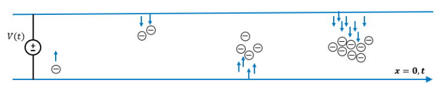

# HFSS Multipaction分析

<figure><figcaption></figcaption></figure>

HFSS Multipaction 提供了一種有限元方法來模擬太空通信系統和真空電子裝置中的真空多重電子反射現象。當空間電荷在被物質包圍的封閉空間內被時諧場加速時，這些電荷可能會從物質表面撞擊電子。如果過渡時間與時諧場同步，則可以維持電子倍增，最終導致電子雪崩。

在衛星上的大型天線進給網絡上，通過測量檢測多重反射現象是困難和昂貴的。對於關鍵任務的太空項目來說，失敗也不是選擇。因此，在將衛星發射入太空之前，有很大的動力使用計算機模擬來識別容易出現多重反射的組件。HFSS 可以指導多重反射抑制措施的設計。

HFSS Multipaction 支持金屬和介質表面上的多重反射。您可以設置一個均勻的 DC 偏置場作為 HFSS Multipaction 的一部分，或使用 Maxwell 近場鏈接來設置非均勻的 DC 偏置場。在設計和模擬方面，這是有幫助的，因為在施加磁偏置後，多重反射不太可能發生。

選用的話，您可以在多重反射分析設置中選擇電荷分佈選項，以輸出用於產生粒子圖和動畫的粒子和幾何網格信息。

前提條件：

* 多重反射分析需要保存驅動端子或驅動模式解的時諧場。
* 雖然 HFSS Multipaction 可以模擬均勻偏置，但要模擬非均勻偏置場的效果，請使用 Maxwell 近場鏈接。

<figure><figcaption></figcaption></figure>
